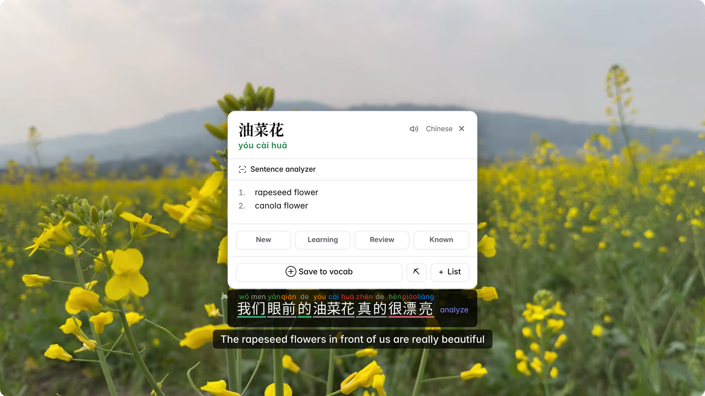
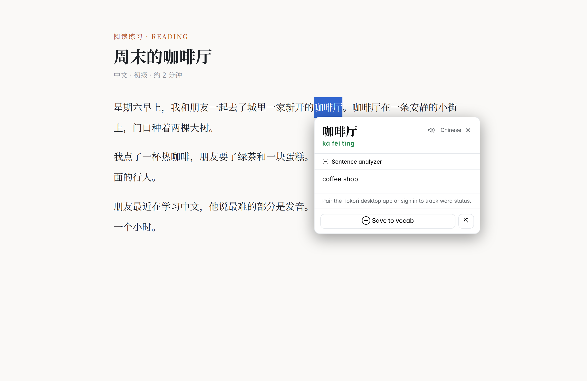
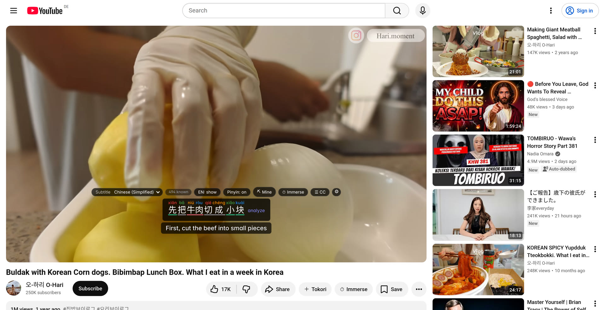
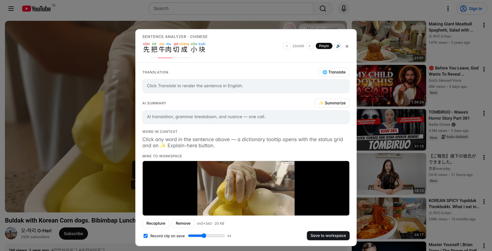
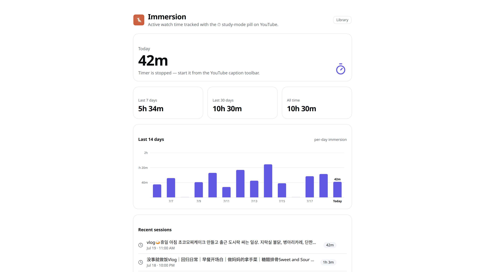

<p align="center">
  
</p>

<h1 align="center">Tokori Companion</h1>

<p align="center">
  <strong>Dual-language subtitles, a hover dictionary, and one-click sentence mining</strong> — on YouTube, Netflix, Disney+, and any page you read.
  <br />
  Local-first, free, no account needed.
</p>

<p align="center">
  <a href="https://github.com/tokoriai/tokori-chrome-extension/actions/workflows/ci.yml"></a>
  <a href="LICENSE"></a>
  <a href="https://tokori.ai"></a>
</p>



Part of the **Tokori** project — the local-first AI language-learning app:
[`tokoriai/tokori`](https://github.com/tokoriai/tokori) is the desktop app
(pair it for workspace sync, SRS status colours, and its dictionaries + AI),
[tokori.ai](https://tokori.ai) the optional cloud. The extension works
standalone — dictionaries and Anki export need no account at all.

> **Status:** pre-1.0. It works, but expect rough edges and breaking changes.

## What it does

**Watch in your target language.** On YouTube the extension overlays a
dual-subtitle strip: the target-language line on top — every word clickable,
with per-character **pinyin / furigana ruby** in tone colours — and a
translation line underneath (show, blur-until-click, or off). A **Subtitle
menu** offers the same choices as YouTube's own CC menu (the automatic pick
for your language, any real caption track, any auto-translate language, or
Off) and follows picks made in YouTube's native menu. Videos with no captions
in your language rest on YouTube's own auto-translation of them; when that
isn't available either, the extension stands down cleanly and says so.

- **Netflix & Disney+ too.** The extension reads the stream's own subtitle
  tracks (WebVTT), so both lines work regardless of — and without — the
  site's subtitle setting. Subtitle text only; the DRM-protected stream is
  untouched.
- **Burned-in subs? OCR them.** For hardcoded subtitles (common on YouTube
  and bilibili.tv), drag a box over the subtitle area once and the extension
  reads changed frames — fully offline with a downloadable
  [tesseract](https://github.com/naptha/tesseract.js) language pack
  (WebAssembly), or with your own AI key's vision model. Recognized lines
  become the same interactive caption bar: word clicks, readings, mining,
  the transcript — everything works.
- **Click any word.** A dictionary popover with readings and glosses, TTS,
  save-to-vocab, and (when paired) the desktop's New / Learning / Review /
  Known status grid. Works on captions **and on any web page** — select a
  word while you read.
- **Transcript sidebar.** An asbplayer-style scrolling transcript next to
  the video: timestamps, click-to-seek, auto-follow, English blur with
  per-line reveal, and copy / analyze / mine actions on every row.
- **Sentence analyzer.** Translation, optional AI summary, word-in-context
  tooltips, and a ‹ › pager that steps through subtitle lines while seeking
  the video along.
- **Sentence mining.** Capture a screenshot and a short A/V clip at the
  cue's moment, cloze-mark the studied word, and fan the card out to
  **Anki** (via [AnkiConnect](https://foosoft.net/projects/anki-connect/),
  with a Migaku-style note-type preset), the Tokori desktop, or the cloud —
  with per-target results when something fails.
- **Immersion tracking.** A ⏱ pill on the caption toolbar counts real watch
  time for videos on your watch library, with a stats page (today / 7-day /
  30-day / all-time, 14-day chart, session log) and a library page with
  per-video progress. Paired, the time also lands live on the Tokori
  desktop's dashboard, heatmap, and streak.
- **A player for your own files.** `player.html` gives any local video file
  (or direct media URL) the same dual-subtitle treatment from SRT/VTT
  files, auto-translation, or the desktop's OCR.
- **Bring-your-own AI keys.** Sentence explanations and OCR vision with
  your own OpenAI, Anthropic, or Gemini key. Keys live in
  `chrome.storage.local` and calls go **straight to the provider** — never
  through Tokori servers.

| Hover dictionary on any page                                      | Transcript sidebar                                                   |
| ----------------------------------------------------------------- | -------------------------------------------------------------------- |
|  |  |
| **Sentence analyzer with mining footer**                          | **Immersion stats**                                                  |
|                      |                          |

More screenshots in [`docs/`](docs/) — the
[options page](docs/options-dictionaries.png), [watch library](docs/library.png),
[toolbar popup](docs/popup.png), and a [clean overlay shot](docs/youtube-overlay.jpg).

## Where it works

| Site               | What you get                                                                                                |
| ------------------ | ----------------------------------------------------------------------------------------------------------- |
| **YouTube**        | Dual subtitles (watch pages, live streams, Shorts), track menu, sidebar, analyzer, mining, OCR, immersion ⏱ |
| **Netflix**        | Dual subtitles harvested from the stream's subtitle tracks                                                  |
| **Disney+**        | Same treatment as Netflix                                                                                   |
| **bilibili.tv**    | OCR dual subtitles (most content there ships burned-in subs)                                                |
| **Any web page**   | Hover dictionary, analyzer, save words, send article to the Tokori reader                                   |
| **Your own files** | Dual-subtitle player page (SRT/VTT, auto-translate, desktop OCR)                                            |

## Install

Not on the Chrome Web Store yet. Grab a build from
[**Releases**](https://github.com/tokoriai/tokori-chrome-extension/releases)
(download the `.zip`, unzip it) or build from source:

```bash
git clone https://github.com/tokoriai/tokori-chrome-extension.git
cd tokori-chrome-extension
npm install
npm run build
```

Then load it:

1. Open `chrome://extensions` and enable **Developer mode** (top-right).
2. Click **Load unpacked** and select the `dist/` folder.
3. Pin the extension and open its **Options** to install a dictionary
   (CC-CEDICT for Chinese, JMdict for Japanese, or import any Yomitan
   `.zip`) and pick your save targets.

## Configuration

Right-click the toolbar icon → **Options**:

| Panel              | What it does                                                      |
| ------------------ | ----------------------------------------------------------------- |
| **General**        | Target language, hover vs. click trigger, translation engine.     |
| **Tokori account** | Sign in to the cloud and pick a workspace (optional).             |
| **Tokori desktop** | Pair with the desktop app's local bridge (optional).              |
| **Anki**           | Deck, note type, field mapping; Migaku preset installer.          |
| **Sentence miner** | Screenshot / clip capture defaults and cloze marking.             |
| **Dictionaries**   | Install CC-CEDICT / JMdict, or import Yomitan / CSV / JSON.       |
| **AI**             | Your OpenAI / Anthropic / Gemini key, model, and local OCR packs. |

## How it talks to Tokori (optional)

Pairing unlocks sync — the extension is fully functional without it.

- **Desktop:** the Tokori desktop app exposes a local HTTP bridge on
  `127.0.0.1:53210`. Pairing exchanges a bearer token (approve the request
  in the app, or paste the token from _Settings → Local API_) so the
  extension can read your workspace and write vocabulary, look up
  dictionaries, grade words, and mirror immersion sessions.
- **Cloud:** signing in stores a bearer token for `api.tokori.ai`, used for
  vocabulary, library, and reader-doc writes.

## Privacy

- API keys and tokens live only in `chrome.storage.local` — never synced
  through your browser profile, never logged.
- BYO AI requests go directly to the provider you chose, from the
  extension's background worker. They are not proxied through Tokori.
- Streaming sites: only subtitle text is read. DRM-protected audio/video
  is never touched.
- **No analytics, no telemetry.**

See [SECURITY.md](./SECURITY.md) for the security model and how to report
issues, and [docs/ARCHITECTURE.md](docs/ARCHITECTURE.md) for how the pieces
fit together.

## Project layout

```
src/
  background.ts           MV3 service worker — message router, caches, save fan-out
  content/
    index.tsx             shadow-DOM React host injected into pages
    HoverPopup.tsx        click-to-define popover (status grid when paired)
    YouTubeEnhancer.tsx   dual-subtitle overlay + caption toolbar
    youtube-cues.ts       MAIN-world hook capturing the player's caption traffic
    netflix-cues.ts       MAIN-world subtitle harvesters for the
    disney-cues.ts          streaming sites (HLS playlists → WebVTT)
    StreamingDualSubs.tsx shared Netflix / Disney+ overlay
    OcrDualSubs.tsx, ocr/ burned-in-subtitle OCR mode (region select, engines)
    SentenceAnalyzerModal.tsx, MiningModal.tsx
    youtube/              caption sidebar, immersion pill, tokenizer, track pick
  lib/                    framework-agnostic logic: settings, anki, ai-providers,
                          dictionaries/, subtitles, immersion, local-library, …
  offscreen/              offscreen document hosting the tesseract OCR worker
  player/ library/ stats/ popup/ options/ welcome/    extension pages
  components/ui/          shadcn/ui primitives
scripts/copy-tesseract.mjs  ships the OCR runtime (+ its Apache-2.0 license)
test/                     Vitest suite for the pure-logic modules
```

## Development

```bash
npm install
npm run dev          # Vite dev server with @crxjs hot reload
npm run build        # type-check + production build → dist/

npm run check        # typecheck + lint + format + tests (what CI runs)
```

Built with Manifest V3, React 18, TypeScript, Vite, and
[@crxjs/vite-plugin](https://crxjs.dev/). See
[CONTRIBUTING.md](./CONTRIBUTING.md) for the workflow and conventions.

## Credits

- The architecture grew out of **hanpanda**, our earlier Chinese-only
  extension, and generalizes it across the languages Tokori supports.
- Dictionary data: [CC-CEDICT](https://www.mdbg.net/chinese/dictionary?page=cc-cedict)
  (CC BY-SA 4.0) and [JMdict](https://www.edrdg.org/jmdict/j_jmdict.html) /
  EDICT (© EDRDG, CC BY-SA 4.0). Custom dictionary imports use the
  [Yomitan](https://github.com/yomidevs/yomitan) format.
- Card export via [AnkiConnect](https://foosoft.net/projects/anki-connect/).
- Local OCR: [tesseract.js](https://github.com/naptha/tesseract.js)
  (Apache-2.0), shipped with its license; language packs from
  [tessdata](https://github.com/tesseract-ocr/tessdata).
- The Netflix subtitle approach was proven over years by
  [Subadub](https://github.com/rsimmons/subadub) and
  [NflxMultiSubs](https://github.com/dannvix/NflxMultiSubs); the transcript
  sidebar takes inspiration from
  [asbplayer](https://github.com/killergerbah/asbplayer).
- UI built with [shadcn/ui](https://ui.shadcn.com/),
  [Radix UI](https://www.radix-ui.com/), and [Lucide](https://lucide.dev/)
  icons.

## License

[MIT](LICENSE)

---

<p align="center">
  Vibe coded by <a href="https://tokori.ai"><strong>● tokori</strong></a> — slow language learning.
</p>
